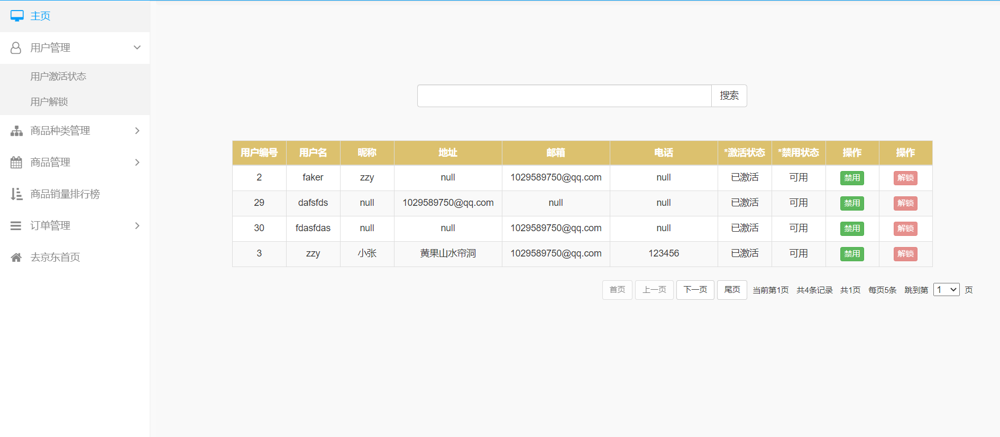

### 仿京东商城项目

#### 京东商城项目介绍

   本项目采用了SSM+Jsp+Html+Css+javascript+Bootstrap来开发的。包含了后台管理系统和基本的京东页面下单流程。

后台管理系统的主要功能有:用户管理,商品种类管理,商品管理,商品销量排行榜统计,订单管理。

前端的流程包括：仿京东商城主页,商品列表页面，商品详情页面，购物车页面，我的订单页面，支付宝支付功能。

##### 用户管理功能




##### 商品种类管理功能


##### 商品管理功能


##### 商品销量排行统计


##### 订单管理


#### 前端页面

##### 京东主页


##### 商品列表页面


##### 商品详情页面


##### 购物车页面


##### 下单页面 

密码六个1


##### 下单成功页面


##### 订单页面


### 下面这些是数据库的表字段

##### 表的逻辑图


####  商品种类表

| 参数名  | 类型   | 具体描述                                 |
| ------- | ------ | ---------------------------------------- |
| cid     | Int    | 分类id                                   |
| cname   | String | 分类名称                                 |
| cparent | Int    | 父级商品id，第0级商品的parent为-1        |
| clevel  | Int    | 商品的层级，1表示一级商品，2表示二级商品 |
| cdesc   | String | 商品种类描述                             |

```sql
create table categorys(
    cid NUMBER(10) primary key,--商品种类id
    cparent NUMBER(10),--商品种类的父级id
    clevel NUMBER(10),--商品种类层级,一级商品是第1层
    cname varchar(50),--商品种类名称
    cdesc varchar(500)--商品种类描述
)
create  sequence seq_categorys start with 0 minvalue 0;
commit;
```

#### 用户表

```sql
Drop table users;
create table users
(
    userid  number(10) primary key,
    username varchar(36),--用户名
    password varchar(36),--密码
    nickname varchar(50),--昵称
    address  varchar(100),--地址
    active number(1),--激活状态
    uenable number(1),--禁用状态 1禁用 0不禁用
uaccess number(1),--权限 1管理员 2普通用户
mail  varchar(36),--邮箱
phone varchar(12)--电话
);
create sequence seq_Users minvalue 0 start with 0;insert into users values(seq_userid.nextval,'zzy','123456','小张','黄果山水帘洞',1,0,1,'1029589750@qq.com','123456');;commit;
```

#### 商品表

```sql
Drop table products;
drop sequence seq_products;
create sequence seq_products minvalue 0 start with 0 increment by 1;
create table products(
  pid  number(10)  primary key,
  pname  varchar2(100),--商品名称
  price   number(10,2),  --价格
  pingjia_sum  number(10),--评价数
xiao_liang    number(10),--销量，自己新添加的
  dianpu_name  varchar2(100),--店铺名 
  product_list_large_image    varchar2(100),--列表页大图
  product_list_small_image1   varchar2(100),--列表页小图
  product_list_small_image2  varchar2(100),
  product_list_small_image3  varchar2(100),
  pdesc  varchar2(500),--商品描述
  product_sum  number(10),--商品数量
  detail_large_img  varchar2(100),--详情页大图
  detail_small_img1 varchar2(100),--详情页小图
  detail_small_img2 varchar2(100),
  detail_small_img3 varchar2(100),
  detail_small_img4 varchar2(100),
  detail_small_img5 varchar2(100),
  shopping_car_img varchar2(100),--购物车商品图片
  onsale  number(1),--1 表示上架  0 表示下架
  cid  number(10),--所属二级商品种类id
  constraint fk_product_categorys_cid foreign key(cid) references categorys(cid)
) ;
```

#### 购物车表

```sql
Drop table usercart;
create sequence seq_usercart minvalue 0 start with 0;
create table usercart(
    cartid int primary key,--主键购物车表id
    userid int references users(userid),--外键用户名
    pid    int references products(pid),--外键商品
    cart_sum int --商品购买的数量
)
```

#### 订单表

```sql
Drop table orders;
create sequence seq_orders minvalue 0 start with 0;
create table orders(
    oid int primary key,
    orders_no varchar(36),--订单编号
    order_time varchar(50),--订单生成时间
    received_address varchar(100),-- 订单地址
all_price int,-- 订单总价
status number(1),--订单状态 0未付款 1已付款 2发货 已完成
    userid number(10) references users(userid)
)
```

#### 订单明细表

```sql
Drop table orderdetail;
create sequence seq_orderdetail minvalue 0 start with 0;
create table orderdetail(
    detail_id int primary key,
    order_sum int,--所购买商品的数量
    oid int references orders(oid),--外键，订单表id
    pid number(10)references products(pid)--外键商品id
)
```

#### 商品属性表

```sql
create sequence seq_properties start with 0 minvalue 0;
create table properties(
    prp_id int primary key,--主键
    cid number(10) references categorys(cid),--商品分类表外键
    pname varchar(36)
)
```

#### 属性选项表

```sql
create table properties_select
(
    psid int primary key,
    pid  int references properties(prp_id),
    psname varchar(36)--属性选项
)
create sequence seq_properties_select minvalue 0 start with 0;
```

